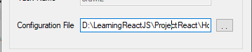

# I use Json server to store data

* config package.json file -> npm init
* install json server -> I think you know it
* install nodemon -> I think you know it

## Some ting about webharvy

You need to know a little about webharvy like:

* install
* crawl data

Arthur

Please use data1,data2,data3.json in my project if you want scheduler my website(config file in webhavy).

